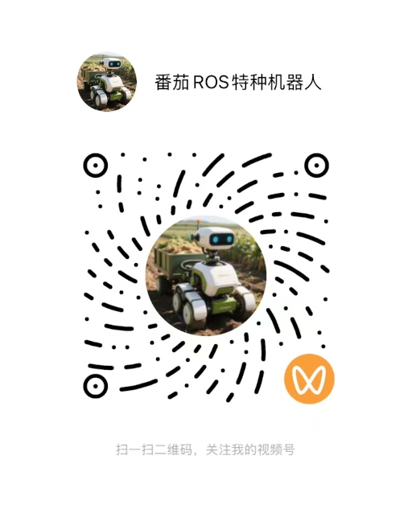

# tomato-can2eth-doc

tomato-can2eth-doc 是 tomato-can2eth 项目的完整配套技术文档，系统梳理了基于 STM32F107VCT6 芯片的 CAN 总线与以太网双向数据透传方案的设计原理、实现流程及应用指南。

该文档针对 tomato-can2eth 项目的核心功能 —— 通过 STM32F107VCT6 的 CAN 控制器与以太网外设，完成 CAN 帧与以太网数据包的双向解析、转换和收发，进行了详尽拆解。

同时聚焦项目的应用价值，即解决无 CAN 总线接口的物联网设备接入 CAN 网络的痛点，为这类设备提供标准化、高兼容性的以太网连接通道，助力工业物联网、农业自动化等场景下的设备组网与数据互通。

tomato-can2eth-doc 作为 tomato-can2eth 跨协议通信项目的官方技术文档，围绕 STM32F107VCT6 主控芯片，深入讲解了 CAN 总线与以太网双向收发功能的技术实现与应用规范。

该项目以 STM32F107VCT6 为核心，构建了轻量化的协议转换网关：一方面接收 CAN 总线数据并封装为以太网数据包向外转发，另一方面将以太网侧的指令与数据解析为 CAN 帧，下发至 CAN 网络中的设备；而 tomato-can2eth-doc 则系统整理了该网关的硬件原理图解析、LwIP 协议栈移植方法、CAN 驱动开发要点、数据透传流程调试技巧及典型应用案例。

其核心目标是为开发者提供一站式技术参考，助力无 CAN 接口的物联网设备快速接入工业或农业场景的 CAN 网络，实现低成本、高效率的通信组网。

## 如何运行

```bash

# 安装nvm
curl -o- https://raw.githubusercontent.com/nvm-sh/nvm/v0.39.7/install.sh | bash

# or
bash nvm-v0.39.7-install.sh

# 加载nvm环境变量
export NVM_DIR="$HOME/.nvm"
[ -s "$NVM_DIR/nvm.sh" ] && \. "$NVM_DIR/nvm.sh"
[ -s "$NVM_DIR/bash_completion" ] && \. "$NVM_DIR/bash_completion"

# 安装nodejs
nvm install 20.11.1
nvm alias default 20.11.1
nvm use 20.11.1

# 创建docusaurus项目
npx create-docusaurus@latest tomato-can2eth-doc classic --javascript

# 进入项目目录
cd tomato-can2eth-doc

# 运行开发服务器,默认情况下，浏览器窗口将在 https://localhost:3000 打开
npm start

# 生成静态网页文件
npm run build

# 运行静态网页服务器
npm run serve

# 部署静态网页
npm run deploy

# 查看docusaurus版本
npx docusaurus --version

```

## 关于作者

公众号《番茄ROS机器人》作者，长期致力于 ROS2 与 Autoware 框架下的低速无人驾驶解决方案研发，专注技术实战与经验沉淀，分享低速无人系统开发中的技术难点、解决方案与行业思考，与开发者共同推动低速无人驾驶技术的落地与创新。

## 关注作者

### 微信号

- 微信号：**smartros**
- 二维码：


### 公众号


### 视频号


