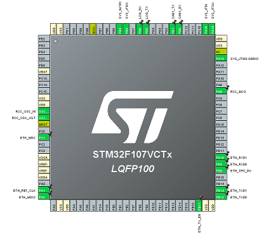
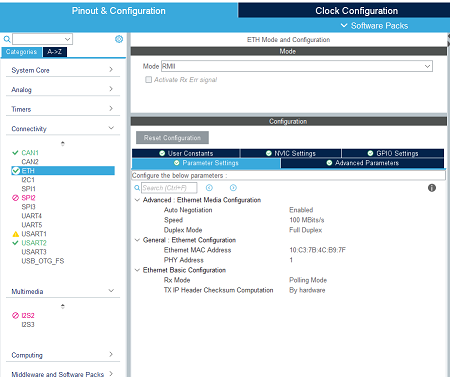

# STM32F107VCT6 开发板 ETH/CAN/LWIP 配置详细操作手册

## 一、文档说明
本文档基于STM32F107VCT6开发板，详细介绍ETH（以太网）、CAN总线外设及LWIP协议栈的配置步骤，包含引脚使能、外设参数配置、LWIP协议栈配置及串口调试日志输出配置，适配STM32CubeMX工具配置流程。

## 二、环境准备
1. **软件环境**
   - STM32CubeMX (Version 6.9.0及以上)
   - MDK-ARM/STM32CubeIDE (编译调试工具)
   - ST-Link驱动 (硬件调试器)
2. **硬件环境**
   - STM32F107VCT6开发板
   - USB转串口模块 (调试日志输出)
   - 网线/CAN总线调试工具 (功能验证)

## 三、引脚使能配置



### 3.1 配置前提
打开STM32CubeMX，新建工程并选择芯片型号`STM32F107VCT6`，进入"Pinout & Configuration"页面。

### 3.2 引脚功能分配
| 引脚       | 功能               | 配置说明                     |
|------------|--------------------|------------------------------|
| PA1        | CAN1_RX            | CAN1接收引脚                 |
| PA2        | CAN1_TX            | CAN1发送引脚                 |
| PA0-WKUP   | 以太网相关         | 以太网唤醒/状态引脚          |
| PC1        | ETH_MDC            | 以太网MAC数据时钟引脚        |
| PC2        | ETH_MDIO           | 以太网MAC数据输入输出引脚    |
| PC3        | ETH_TX_CLK         | 以太网发送时钟引脚           |
| PB11       | ETH_TX_EN          | 以太网发送使能引脚           |
| PB12       | ETH_TXD0           | 以太网发送数据0引脚          |
| PB13       | ETH_TXD1           | 以太网发送数据1引脚          |
| PA7        | ETH_CRS            | 以太网载波侦听引脚           |
| PD8        | ETH_RXD0           | 以太网接收数据0引脚          |
| PD9        | ETH_RXD1           | 以太网接收数据1引脚          |
| PD10       | ETH_RX_ER          | 以太网接收错误引脚           |
| PD11       | ETH_RX_EN          | 以太网接收使能引脚           |
| PD12       | ETH_RX_CLK         | 以太网接收时钟引脚           |
| USART1_TX/ | 调试串口           | 根据开发板实际引脚配置       |
| USART1_RX  |                    |                              |

### 3.3 配置步骤
1. 在STM32CubeMX的引脚配置界面，找到上述引脚，点击引脚下拉菜单选择对应功能；
2. 确保所有引脚未被其他外设占用（若有冲突，优先保留ETH/CAN功能）；
3. 配置完成后，点击"Configuration"标签进入外设配置页面。

## 四、ETH外设配置



### 4.1 基础配置
1. 进入"Connectivity" -> "ETH"配置界面；
2. **模式选择**：选择"RMII"模式（STM32F107推荐使用RMII，减少引脚占用）；
3. **时钟配置**：
   - ETH时钟源选择`HSE` (高速外部时钟)；
   - 确保HSE时钟频率为8MHz/25MHz（根据开发板晶振配置）；
4. **MAC配置**：
   - 使能"MAC Reception"和"MAC Transmission"；
   - 帧过滤模式选择"Unicast & Multicast"；
   - 最大帧长度设置为1518字节（标准以太网帧长度）；
5. **中断配置**：
   - 使能ETH全局中断；
   - 优先级设置：抢占优先级2，子优先级0（可根据实际需求调整）。

### 4.2 高级配置
1. 使能"Automatic Pad/Strip"（自动填充/剥离帧尾）；
2. 使能"Automatic CRC Generation"（自动生成CRC校验）；
3. 禁用"Loopback Mode"（回环模式，仅调试时启用）；
4. 点击"OK"保存ETH配置。

## 五、CAN外设配置


### 5.1 CAN1基础配置
1. 进入"Connectivity" -> "CAN1"配置界面；
2. **模式选择**：
   - 工作模式选择"Normal"（正常模式，调试时可先选Loopback模式）；
   - 时间触发通信模式（TTCM）：禁用；
   - 自动离线管理（ABOM）：使能；
   - 自动重传（AWUM）：使能；
3. **波特率配置**（关键）：
   - 假设目标波特率为500Kbps，HSE=8MHz，配置如下：
     - 预分频器 (Prescaler)：4；
     - 同步跳转宽度 (SJW)：1TQ；
     - BS1：13TQ；
     - BS2：2TQ；
     - 计算公式：`波特率 = APB1时钟 / (Prescaler * (BS1+BS2+1))`（APB1时钟最大36MHz）；
4. **过滤器配置**：
   - 过滤器模式选择"Mask Mode"（掩码模式）；
   - 过滤器类型选择"32-bit"；
   - 过滤器分配给CAN1，过滤器编号0；
   - 过滤器触发模式：禁用FIFO溢出中断（根据需求调整）。

### 5.2 CAN中断配置
1. 使能CAN1接收FIFO非空中断、发送完成中断；
2. 中断优先级：抢占优先级3，子优先级0；
3. 点击"OK"保存CAN配置。

## 六、LWIP协议栈配置


### 6.1 启用LWIP
1. 进入"Middleware" -> "LWIP"配置界面；
2. 勾选"Enable LWIP"，选择LWIP版本（推荐V2.1.2）；

### 6.2 核心配置
1. **IP地址配置**：
   - 选择"Static IP"（静态IP）或"DHCP"（动态IP）；
   - 静态IP示例：
     - IP地址：192.168.1.100；
     - 子网掩码：255.255.255.0；
     - 网关：192.168.1.1；
     - DNS服务器：8.8.8.8；
2. **协议使能**：
   - 使能TCP、UDP、ICMP（ping功能）；
   - 使能DHCP客户端（若使用动态IP）；
   - 禁用IPV6（STM32F107资源有限，优先IPV4）；
3. **内存配置**：
   - TCP发送缓冲区：2048字节；
   - TCP接收缓冲区：2048字节；
   - UDP缓冲区：1024字节；
   - 最大TCP连接数：4；

### 6.3 高级配置
1. 使能"LWIP Debug Output"（调试输出）；
2. 使能"ETH Link Status Check"（以太网链路状态检测）；
3. 禁用"PPP"（点对点协议，非必需）；
4. 点击"OK"保存LWIP配置。

## 七、串口调试日志配置


### 7.1 串口外设配置
1. 进入"Connectivity" -> "USART1"（或开发板实际调试串口）；
2. 模式选择"Asynchronous"（异步模式）；
3. 参数配置：
   - 波特率：115200；
   - 数据位：8；
   - 停止位：1；
   - 校验位：None；
   - 流控：Disabled；
4. 使能串口全局中断（优先级：抢占优先级4，子优先级0）；

### 7.2 重定向printf函数
1. 在工程中添加串口重定向代码（以MDK为例）：
```c
#include "stdio.h"
#include "stm32f1xx_hal.h"

// 重定向fputc函数，支持printf输出到串口
int fputc(int ch, FILE *f)
{
  HAL_UART_Transmit(&huart1, (uint8_t *)&ch, 1, HAL_MAX_DELAY);
  return ch;
}

// 禁用半主机模式（必须）
#pragma import(__use_no_semihosting)
struct __FILE
{
  int handle;
};
FILE __stdout;
void _sys_exit(int x)
{
  x = x;
}
```
2. 在需要输出日志的地方调用`printf`函数，示例：
```c
// 初始化完成后输出日志
printf("STM32F107 ETH/CAN/LWIP Config OK!\r\n");
printf("IP Address: 192.168.1.100\r\n");
printf("CAN Baudrate: 500Kbps\r\n");
```

### 7.3 日志输出验证
1. 编译工程并下载到开发板；
2. 串口工具（如SecureCRT/串口助手）配置：波特率115200、8N1、无流控；
3. 开发板上电后，串口工具应显示配置完成的日志信息。

## 八、工程生成与编译
1. 在STM32CubeMX中点击"Project Manager"；
2. 配置工程名称、保存路径、工具链（MDK-ARM/STM32CubeIDE）；
3. 点击"GENERATE CODE"生成工程代码；
4. 打开生成的工程，编译并解决可能的依赖错误；
5. 下载代码到开发板，验证ETH/CAN/LWIP功能。

## 九、常见问题排查
1. **以太网无法通信**：
   - 检查RMII引脚配置是否正确；
   - 确认HSE时钟是否正常起振；
   - 检查LWIP IP地址与网关是否在同一网段；
2. **CAN通信失败**：
   - 重新计算CAN波特率参数；
   - 检查CAN收发器（如TJA1050）供电是否正常；
   - 确认CAN总线终端电阻（120Ω）是否焊接；
3. **串口无日志输出**：
   - 检查串口引脚配置是否正确；
   - 确认printf重定向代码是否添加；
   - 检查串口工具参数是否匹配。

### 总结

1. STM32F107VCT6配置核心：ETH选RMII模式、CAN波特率需精准计算、LWIP优先配置静态IP；
2. 引脚配置需避免冲突，优先保障ETH/CAN核心引脚功能；
3. 串口日志重定向是调试关键，需禁用半主机模式并正确实现fputc函数。